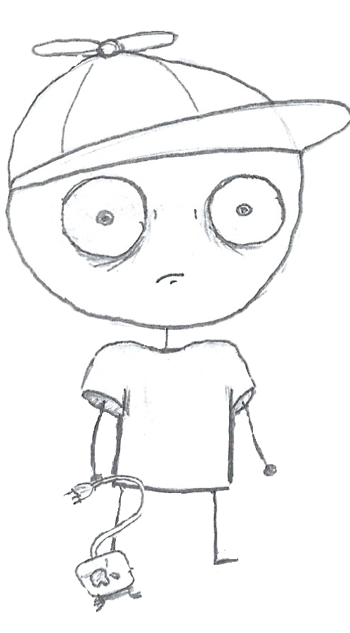
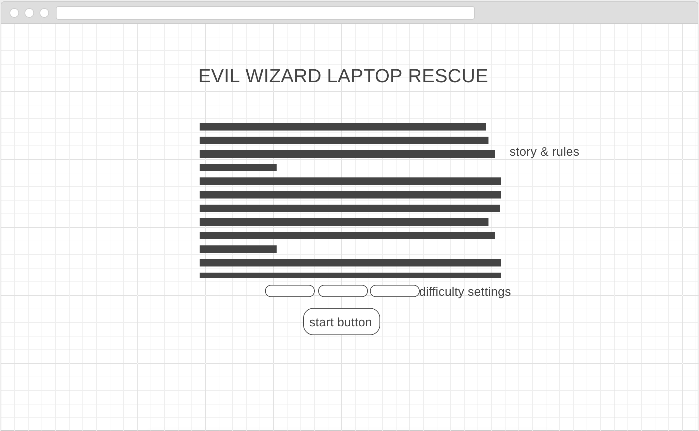
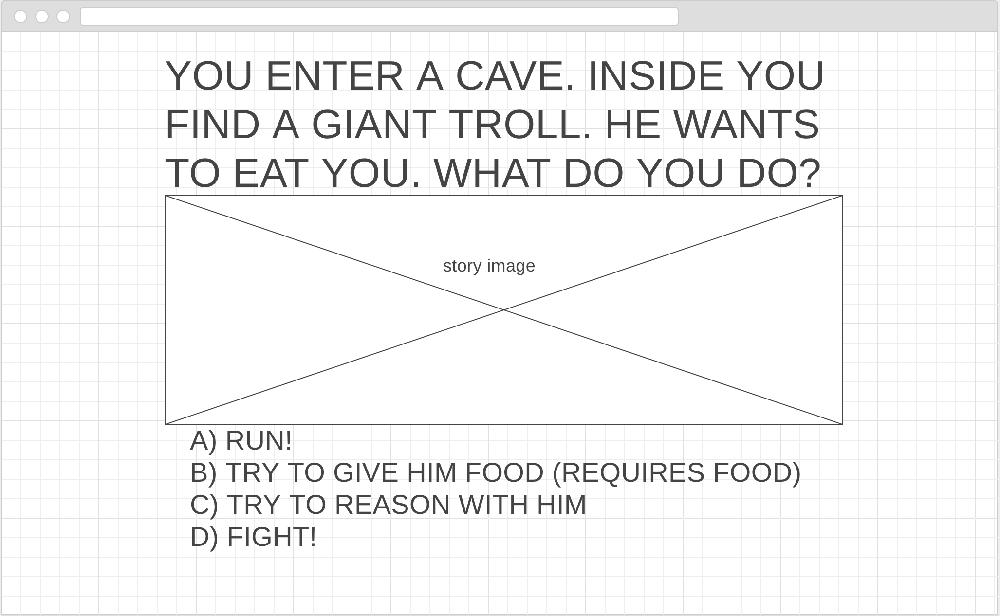

## TEXT ADVENTURE GAME

**PLAYE THE GAME [HERE](https://drisdon.github.io/text-adventure/)**

**STORY?**

An EVIL wizard has stolen your laptop and disappeared into another dimension! Go get it back! You will encounter strange people and creatures
on your journey, so be prepared for a fight!

**RULES**

Player begins with:
- 10 health
- a macbook charger as a blunt weapon
- no armor (armor just gives you extra health)
- no money

You start outside the portal into another dimension. You are presented with 2 choices: go in after the wizard, or go buy a new laptop.
Buying a new laptop ends the game immediately. Going into the portal initiates the game. You will progress through a series of story choices,
some involving dialogue, some involving combat. Wrong choices in combat might lead to you taking damage. You can make choices along the way that
give you more health, or new weapons and armor. If you make it to the final story scene and defeat the final boss without losing all health, you win!

*combat:*
When you make a choice that has you fighting (they will say [combat] next to them), your damage will be compared to the enemy's health. If you can't defeat them in 1 hit, you will take damage for every hit it takes you to win. If your health hits 0, you lose.

**TECH AND APPROACH**

This game primarily makes use of JQuery for DOM manipulation. Everything else is vanilla JavaScript, CSS and HTML. All images were hand-drawn.

The game is set up in an object-oriented manner, through a sort of linked directed graph data structure. There are objects for the player, each possible scene and all of their possible choices, enemies, items, and NPC's. The player has methods for acquiring items, fighting, and rendering, based on new items and stats. The scenes have a property linked to all of the possible choices that can be made at the time. The actual changing of scenes happens in a global `nextScene()` function, which eventually calls the `render()` functions of the player and scene.

Combat is calculated based on player health and damage versus enemy health and damage. If the player fails to win a battle in 1 turn, the enemy will deal a random portion of their damage stat for every turn they are still alive.

**SETUP FOR OTHER STORIES**

This game is designed to take any story input you may desire, as long as it fits the template.

The scenes array must be an array of scenes, each formatted like this:

`['scene name', 'scene prompt', 'background-image', ['choice 1 prompt', 'choice 1 next scene', 'enemy name', 'item'], 'npc']`

The array of choices can have any number of choices, and the combat stats are optional. Leave the combat array empty if there is no combat in a particular scene.

You must have 1 scene with the name `'start'`, one with the name `'lose'`, and another with the name `'win'`. The final scene can be called anything, and can optionally link back to `'start'`.

Items are also optional. Make it an empty string if there is no item to be found.

For run away choices, include the enemy as well, even though you won't be fighting it. Its stats are needed to calculate escape damage.

NPC's should only be present when there is no enemy.

**WIREFRAMES**

